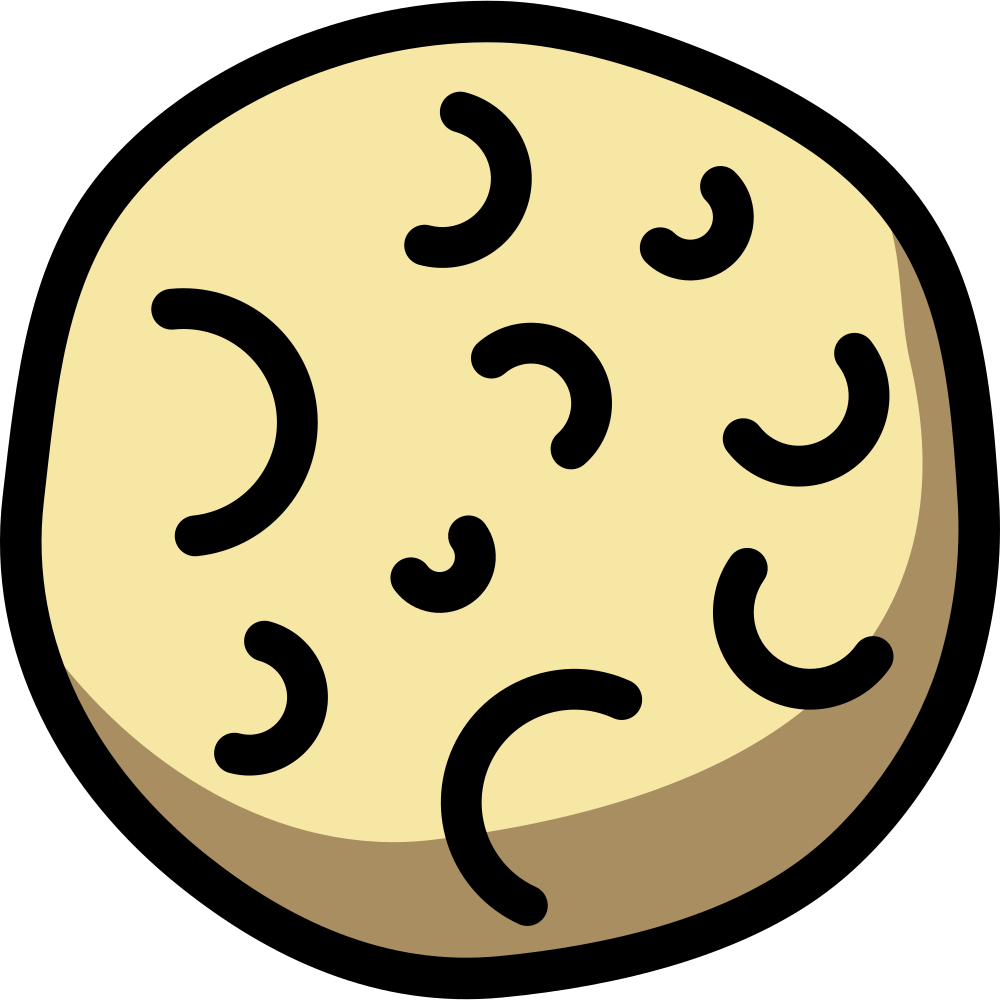
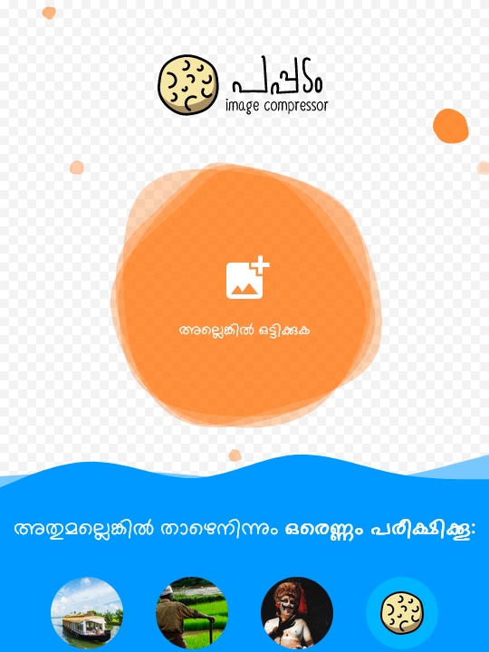
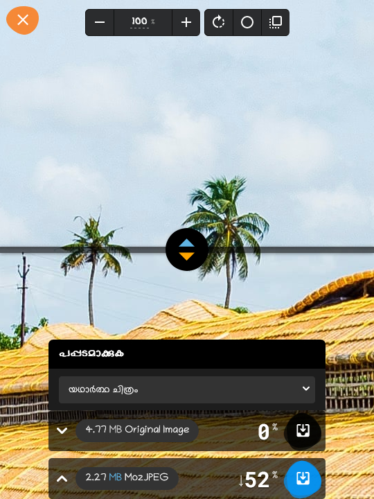
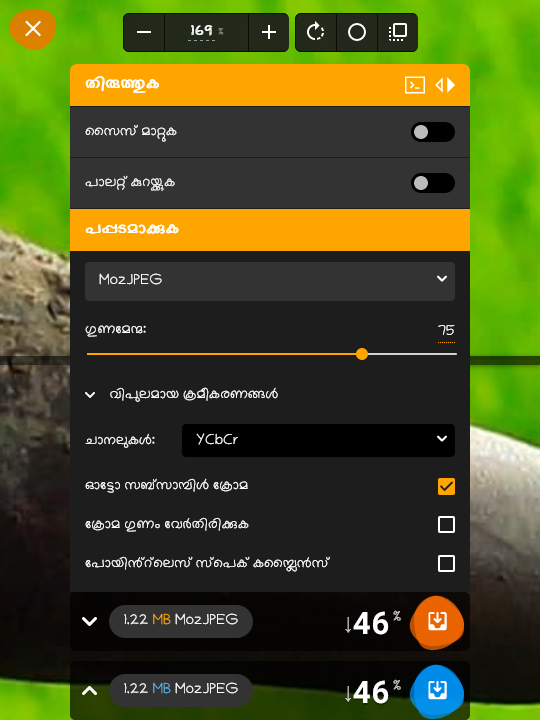

    
  

<strong>
  <em>ഇമേജ് ഫയലുകളെ പപ്പടം പോലെ ഇടിച്ചൊതുക്കാൻ ഒരു സൗജന്യ വെബ് ആപ്പ്!</em>
</strong> 
<a href="https://pappadam.digitalmalayali.in/">വെബ് ആപ്പിലേക്ക് പോവാൻ ഇവിടെ ക്ലിക്ക് ചെയ്യുക</a>.
  
  
ഗൂഗിൾ ക്രോം ലാബ്സിന്റെ <a href="https://github.com/GoogleChromeLabs/squoosh">Squoosh</a> ആപ്പിൽ നിന്നും നൈസായിട്ട് ചൂണ്ടിയത്. 😏

 

## സ്വകാര്യത 👀
പപ്പടം നിങ്ങളുടെ ചിത്രങ്ങൾ ഏതെങ്കിലും സെർവറിലേക്ക് അപ്‌ലോഡ് ചെയ്യുന്നില്ല. നിങ്ങളുടെ ഡിവൈസിൽ വെച്ചുതന്നെയാണ് ‘പപ്പടമാക്കൽ’ നടത്തുന്നത്.
- അടിസ്ഥാനപരമായ ഉപയോക്തൃവിവരങ്ങൾ ശേഖരിക്കുന്നു.
- വെബ് ആപ്പിൽ ഗൂഗിൾ അനലക്റ്റിക്സ് & മൈക്രോസോഫ്റ്റ് ക്ലാരിറ്റി ഉപയോഗിക്കുന്നുണ്ട്.

## ഈ പ്രൊജക്റ്റിനെ പിന്തുണയ്ക്കാനുള്ള വഴികൾ 💕

- ഈ റിപ്പോസിറ്ററി **സ്റ്റാർ** ചെയ്യുക.
- മാറ്റങ്ങളെയും പുതുമകളെയും പറ്റി അറിയാൻ റിലീസുകൾ **നിരീക്ഷിക്കുക**.
- ഈ പ്രൊജക്റ്റ് നിങ്ങൾക്ക് ഇഷ്ടപ്പെട്ടാൽ മറ്റുള്ളവരുമായി പങ്കുവെയ്ക്കുമല്ലോ!
- ഞങ്ങളുടെ [ബ്ലോഗ്](https://www.digitalmalayali.in) വായിക്കാം.
- [ട്വിറ്ററിൽ](https://twitter.com/digimalayali) ഞങ്ങളെ ബന്ധപ്പെടാം.

നിങ്ങളുടെ താത്പര്യത്തിന് നന്ദി! :heart:

## സ്ക്രീൻഷോട്ടുകൾ 💻

 
 

## ലൈസൻസ് 📝

[Apache-2.0 license](LICENSE)

© പകർപ്പവകാശം 2022 ഡിജിറ്റൽ മലയാളി, ഗൂഗിൾ ക്രോം ലാബ്സ്
